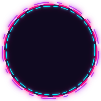

<!--
━━━━━━━━━━━━━━━━━━━━━━━━━━━━━━━━━━━━━━━━━━━━━━━━━━━━━━━━━━━━━━━━━━━━━━━━━━━━━━━━
                    PREMIUM DEVELOPER DASHBOARD PORTFOLIO README
━━━━━━━━━━━━━━━━━━━━━━━━━━━━━━━━━━━━━━━━━━━━━━━━━━━━━━━━━━━━━━━━━━━━━━━━━━━━━━━━
Instructions to customize:
1. Search and replace "BuiltByAmos-1801" with your actual GitHub username.
2. Search and replace "Amos Anand" with your actual name.
3. Update email (builtbiamos@gmail.com) and website link (https://builtbyamos.in).
━━━━━━━━━━━━━━━━━━━━━━━━━━━━━━━━━━━━━━━━━━━━━━━━━━━━━━━━━━━━━━━━━━━━━━━━━━━━━━━━
-->

  

  

 

<!-- ==================== WIDGET 1: BIO & METRICS ==================== -->
<table align="center" border="0" cellpadding="15" cellspacing="0" width="100%">
  <tr>
    <!-- Profile circular HUD -->
    <td width="30%" align="center" valign="middle">
      
    </td>
    <!-- Detailed Bio & Contacts -->
    <td width="70%" valign="top">
      <h2>🚀 System Overview: Amos Anand</h2>
      

        I am an award-winning <strong>UI/UX Designer, Frontend Developer, and SaaS Architect</strong>. I specialize in building ultra-performance web platforms, custom ERP/CRM panels, and intelligent AI automation pipelines.
      

      
      <table border="0" cellpadding="4" cellspacing="0" width="100%">
        <tr>
          <td>🏢 <b>Current Work:</b></td>
          <td>Founder &amp; Principal Architect at <a href="https://builtbyamos.in" target="_blank">Built By Amos</a> (MSME registered)</td>
        </tr>
        <tr>
          <td>📍 <b>Base Location:</b></td>
          <td>Ranchi, Jharkhand, India</td>
        </tr>
        <tr>
          <td>🛠️ <b>Core Architecture:</b></td>
          <td>Lightweight JavaScript, Node.js, PostgreSQL (Zero CSS Framework bloat)</td>
        </tr>
        <tr>
          <td>⚡ <b>Fun Fact:</b></td>
          <td>We compile code to optimize for perfect Lighthouse and Core Web Vitals.</td>
        </tr>
      </table>
    </td>
  </tr>
</table>

<!-- Dynamic Badges / Social Connect buttons -->

  
  
  
  

---

<!-- ==================== WIDGET 2: CORE CAPABILITIES ==================== -->
<h3>⚡ Interactive Skill Metrics</h3>

Our core capabilities are monitored in real-time. Below is our engineering dashboard status:

  

---

<!-- ==================== WIDGET 3: TECH CONSOLE ==================== -->
<h3>🛠️ Unified Technology Grid</h3>

<table>
  <tr>
    <td width="33%" valign="top">
      <h4>💻 Languages</h4>
      
       
      
       
      
       
      
    </td>
    <td width="33%" valign="top">
      <h4>⚙️ Frameworks &amp; APIs</h4>
      
       
      
       
      
    </td>
    <td width="34%" valign="top">
      <h4>🗄️ Database &amp; Tooling</h4>
      
       
      
       
      
      
    </td>
  </tr>
</table>

---

<!-- ==================== WIDGET 4: FEATURED REPOS ==================== -->
<h3>📂 Featured Product Showcases</h3>

<table width="100%" border="0" cellpadding="10" cellspacing="0">
  <tr>
    <!-- Project 1 -->
    <td width="50%" valign="top">
      

        <h4 style="margin-top: 0; color: #58a6ff;">📶 WiFi Camera Scanner Pro</h4>
        
Advanced security auditing application designed to scan local networks, detect connected IP cameras, and analyze vulnerability profiles.

        

          
          
        

         
        <a href="https://github.com/BuiltByAmos-1801/WiFi-Camera-Scanner-Pro" style="font-size: 12px; font-weight: bold; color: #00f0ff; text-decoration: none;">📁 Source Code</a>
      

    </td>
    <!-- Project 2 -->
    <td width="50%" valign="top">
      

        <h4 style="margin-top: 0; color: #58a6ff;">🎬 AI Movie Recommender System</h4>
        
Interactive web application powered by Python AI vector libraries to generate context-aware movie recommendations.

        

          
          
        

         
        <a href="https://github.com/BuiltByAmos-1801/Ai-Movie-recommendations-system" style="font-size: 12px; font-weight: bold; color: #00f0ff; text-decoration: none;">📁 Source Code</a>
      

    </td>
  </tr>
</table>

---

<!-- ==================== WIDGET 5: PERFORMANCE STATS ==================== -->
<h3>📊 Git Metrics Console</h3>

  <table border="0" cellpadding="0" cellspacing="10">
    <tr>
      <!-- General Stats Card -->
      <td valign="top">
        
      </td>
      <!-- Language Stats Card -->
      <td valign="top">
        
      </td>
    </tr>
    <tr>
      <!-- GitHub Streak Tracker -->
      <td valign="top">
        
      </td>
      <!-- Profile Views Tracker -->
      <td valign="top" align="center">
          
        
          
        
      </td>
    </tr>
  </table>

---

<!-- ==================== WIDGET 6: SYSTEM TROPHIES & SNAKE ==================== -->
<h3>🏆 Achievements &amp; Contributions</h3>

  

  <!-- Contribution grid snake animation. Make sure your GitHub Actions workflows generate this at the branch path output -->
  

---

<!-- ==================== WIDGET 7: DEVELOPER CONSOLE QUOTE ==================== -->

  

  

