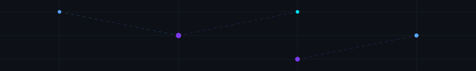

<!--
━━━━━━━━━━━━━━━━━━━━━━━━━━━━━━━━━━━━━━━━━━━━━━━━━━━━━━━━━━━━━━━━━━━━━━━━━━━━━━━━
                       PREMIUM PORTFOLIO DASHBOARD PORTFOLIO
━━━━━━━━━━━━━━━━━━━━━━━━━━━━━━━━━━━━━━━━━━━━━━━━━━━━━━━━━━━━━━━━━━━━━━━━━━━━━━━━
Instructions to customize:
1. Search and replace "BuiltByAmos-1801" with your actual GitHub username.
2. Search and replace "Amos Anand" with your actual name.
3. Update email (builtbiamos@gmail.com) and website link (https://builtbyamos.in).
━━━━━━━━━━━━━━━━━━━━━━━━━━━━━━━━━━━━━━━━━━━━━━━━━━━━━━━━━━━━━━━━━━━━━━━━━━━━━━━━
-->

<!-- TOP VISUAL HEADER MESH -->

  

<!-- HERO CARD BANNER -->

  

<!-- CYCLING ROLES TYPING INDICATOR -->

  

 

<!-- ==================== MAIN DASHBOARD CONSOLE ==================== -->
<table border="0" cellpadding="0" cellspacing="15" width="100%" align="center">
  <tr>
    
    <!-- ━━━━━━━━━━━━━━━━━━ COLUMN 1: LEFT SIDEBAR (28%) ━━━━━━━━━━━━━━━━━━ -->
    <td width="28%" valign="top">
      
      <!-- Developer Info Card -->
      <table border="0" cellpadding="10" cellspacing="0" width="100%" style="background-color: #161b22; border: 1.5px solid #30363d; border-radius: 16px; color: #f0f6fc;">
        <tr>
          <td>
            <h4 style="margin: 0; color: #58a6ff; font-family: sans-serif;">🧑‍💻 System Operator</h4>
            

            
<b>Operator:</b> Amos Anand

            
<b>Status:</b> ● Active (Online)

            
<b>Focus:</b> Full Stack Architecture

            
<b>Loc:</b> Ranchi, Jharkhand, IN

          </td>
        </tr>
      </table>
      
       
      
      <!-- Navigation Widget -->
      <table border="0" cellpadding="10" cellspacing="0" width="100%" style="background-color: #161b22; border: 1.5px solid #30363d; border-radius: 16px; color: #f0f6fc;">
        <tr>
          <td>
            <h4 style="margin: 0; color: #58a6ff; font-family: sans-serif;">🧭 Navigation System</h4>
            

            <ul style="font-size: 13px; margin: 0; padding-left: 15px; line-height: 1.8;">
              <li><a href="#about" style="color: #00e5ff; text-decoration: none;">/About_Me</a></li>
              <li><a href="#skills" style="color: #00e5ff; text-decoration: none;">/Core_Capabilities</a></li>
              <li><a href="#tech" style="color: #00e5ff; text-decoration: none;">/Tech_Arsenal</a></li>
              <li><a href="#projects" style="color: #00e5ff; text-decoration: none;">/Featured_Products</a></li>
              <li><a href="#experience" style="color: #00e5ff; text-decoration: none;">/Experience_Timeline</a></li>
            </ul>
          </td>
        </tr>
      </table>
      
       
      
      <!-- Quick metrics badges -->
      <table border="0" cellpadding="10" cellspacing="0" width="100%" style="background-color: #161b22; border: 1.5px solid #30363d; border-radius: 16px; color: #f0f6fc;">
        <tr>
          <td align="center">
            <h4 style="margin: 0 0 10px 0; color: #58a6ff; font-family: sans-serif;">📊 Metrics Overview</h4>
             
             
            
          </td>
        </tr>
      </table>
      
    </td>
    
    <!-- ━━━━━━━━━━━━━━━━━━ COLUMN 2: CENTER PANEL (44%) ━━━━━━━━━━━━━━━━━━ -->
    <td width="44%" valign="top">
      
      <h3 id="about" style="color: #f0f6fc; margin-top: 0;">⚡ Bio System</h3>
      

        I am a senior UI/UX designer and software architect driving MSME software firm <b>Built By Amos</b>. Our engineering philosophy targets ultra-performant Web and SaaS frameworks by focusing on raw efficiency, zero boilerplate, and native JavaScript compilation.
      

      
      <h3 id="skills" style="color: #f0f6fc;">📊 Core Capabilities Monitor</h3>
      

        
      

      
      <h3 style="color: #f0f6fc;">🎯 Current Objectives</h3>
      <ul style="font-size: 13px; color: #8b949e; line-height: 1.7; padding-left: 20px;">
        <li>🚀 <b>Building:</b> High-concurrency custom CRM/ERP platforms.</li>
        <li>🧠 <b>Learning:</b> Neural-Network vector pipelines and LLM fine-tuning.</li>
        <li>⚙️ <b>Open Source:</b> Contributing to vector DB optimization tooling.</li>
      </ul>
      
    </td>
    
    <!-- ━━━━━━━━━━━━━━━━━━ COLUMN 3: RIGHT SIDEBAR (28%) ━━━━━━━━━━━━━━━━━━ -->
    <td width="28%" valign="top">
      
      <!-- Git Stats Console -->
      <table border="0" cellpadding="10" cellspacing="0" width="100%" style="background-color: #161b22; border: 1.5px solid #30363d; border-radius: 16px; color: #f0f6fc;">
        <tr>
          <td align="center">
            <h4 style="margin: 0 0 10px 0; color: #58a6ff; font-family: sans-serif;">📈 Performance stats</h4>
            
            
            
          </td>
        </tr>
      </table>
      
       
      
      <!-- Visitor Monitor badge -->
      <table border="0" cellpadding="10" cellspacing="0" width="100%" style="background-color: #161b22; border: 1.5px solid #30363d; border-radius: 16px; color: #f0f6fc;">
        <tr>
          <td align="center">
            <h4 style="margin: 0 0 10px 0; color: #58a6ff; font-family: sans-serif;">🌍 Visitors Log</h4>
            
          </td>
        </tr>
      </table>
      
    </td>
  </tr>
</table>

<!-- ==================== DOWNSIDE PANELS (100% WIDTH) ==================== -->

 

  

<!-- ==================== WIDGET: TECH ARSENAL ==================== -->
<h3 id="tech" style="color: #f0f6fc;">🛠️ Tech Arsenal</h3>

Unified core development stack and tooling registry:

<table width="100%">
  <tr>
    <td width="33%" valign="top">
      <strong>💻 Languages</strong> 
      
       
      
       
      
       
      
    </td>
    <td width="33%" valign="top">
      <strong>⚙️ Frameworks &amp; APIs</strong> 
      
       
      
       
      
    </td>
    <td width="34%" valign="top">
      <strong>🗄️ Database &amp; System</strong> 
      
       
      
       
      
      
    </td>
  </tr>
</table>

 

<!-- ==================== WIDGET: FEATURED PRODUCTS ==================== -->
<h3 id="projects" style="color: #f0f6fc;">📂 Featured Product Showcases</h3>

<table width="100%" border="0" cellpadding="10" cellspacing="0">
  <tr>
    <td width="50%" valign="top">
      

        <h4 style="margin-top: 0; color: #58a6ff;">📶 WiFi Camera Scanner Pro</h4>
        
Advanced security audit software targeting local networks, designed to discover connected IP cameras and analyze vulnerability profiles.

        

          
          
        

         
        <a href="https://github.com/BuiltByAmos-1801/WiFi-Camera-Scanner-Pro" style="font-size: 12px; font-weight: bold; color: #00e5ff; text-decoration: none;">📁 Source Code</a>
      

    </td>
    <td width="50%" valign="top">
      

        <h4 style="margin-top: 0; color: #58a6ff;">🎬 AI Movie Recommender System</h4>
        
Context-aware dynamic movie recommendation application built with vector search logic and Python neural tools.

        

          
          
        

         
        <a href="https://github.com/BuiltByAmos-1801/Ai-Movie-recommendations-system" style="font-size: 12px; font-weight: bold; color: #00e5ff; text-decoration: none;">📁 Source Code</a>
      

    </td>
  </tr>
</table>

 

<!-- ==================== WIDGET: EXPERIENCE TIMELINE ==================== -->
<h3 id="experience" style="color: #f0f6fc;">💼 Experience Timeline</h3>

<table border="0" cellpadding="8" cellspacing="0" width="100%">
  <tr>
    <td width="20%" valign="top" style="border-right: 2px solid #30363d; text-align: right; padding-right: 15px; color: #58a6ff;">
      <b>2025 - Present</b>
    </td>
    <td width="80%" valign="top" style="padding-left: 15px;">
      <h4 style="margin: 0; color: #f0f6fc;">Founder &amp; Tech Lead</h4>
      
Built By Amos (Software &amp; Web Engineering Agency)

      
Managing project life cycles, custom web SaaS platforms, database design (PostgreSQL/SQL), and MSME operations.

    </td>
  </tr>
  <tr>
    <td width="20%" valign="top" style="border-right: 2px solid #30363d; text-align: right; padding-right: 15px; color: #7c3aed;">
      <b>2023 - 2024</b>
    </td>
    <td width="80%" valign="top" style="padding-left: 15px;">
      <h4 style="margin: 0; color: #f0f6fc;">Freelance Software Engineer</h4>
      
Remote Dev Contracts

      
Built bespoke inventory programs, CRM tools, and camera scans algorithms for Android networks.

    </td>
  </tr>
</table>

 

<!-- ==================== EXTRA PREMIUM SECTIONS ==================== -->
<table width="100%" border="0" cellpadding="10" cellspacing="0">
  <tr>
    <td width="50%" valign="top">
      

        <h4 style="margin-top: 0; color: #58a6ff;">🌟 Engineering Vision</h4>
        
To build clean, zero-bloat digital experiences that load instantly, scale naturally, and enhance client operational productivity. We believe coding is a fine balance between math and art.

      

    </td>
    <td width="50%" valign="top">
      

        <h4 style="margin-top: 0; color: #7c3aed;">🛠️ Technical Arsenal</h4>
        
<b>OS:</b> Linux / Windows <b>Editor:</b> VS Code / Cursor <b>Shell:</b> PowerShell / Bash <b>Music:</b> Retrowave / Synthwave Beats

      

    </td>
  </tr>
</table>

 

<!-- ==================== WIDGET: DYNAMIC SYSTEM TROPHIES & SNAKE ==================== -->
<h3>🏆 System Trophies &amp; Contribution Snake</h3>

  

<!-- CONTRIBUTION SNAKE ANIMATION (Pushed by snake.yml Action) -->

  

<!-- DYNAMIC DEV QUOTE -->

  

 

<!-- FOOTER WITH OVERLAPPING ANIMATED LIQUID WAVES -->

  

