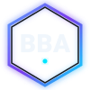

<!--
━━━━━━━━━━━━━━━━━━━━━━━━━━━━━━━━━━━━━━━━━━━━━━━━━━━━━━━━━━━━━━━━━━━━━━━━━━━━━━━━
                    PREMIUM DEVELOPER DASHBOARD PORTFOLIO README
━━━━━━━━━━━━━━━━━━━━━━━━━━━━━━━━━━━━━━━━━━━━━━━━━━━━━━━━━━━━━━━━━━━━━━━━━━━━━━━━
Instructions to customize:
1. Search and replace "BuiltByAmos-1801" with your actual GitHub username.
2. Search and replace "Amos Anand" with your actual name.
3. Update email (builtbiamos@gmail.com) and website link (https://builtbyamos.in).
━━━━━━━━━━━━━━━━━━━━━━━━━━━━━━━━━━━━━━━━━━━━━━━━━━━━━━━━━━━━━━━━━━━━━━━━━━━━━━━━
-->

<!-- TOP VISUAL HEADER MESH -->

<!-- HERO CARD BANNER -->

<!-- CYCLING ROLES TYPING INDICATOR -->

 

<!-- ==================== MAIN DASHBOARD CONSOLE ==================== -->
<table border="0" cellpadding="0" cellspacing="10" width="100%" align="center">
<tr>
<td width="28%" valign="top">

<!-- Developer Info Card -->
<table border="0" cellpadding="10" cellspacing="0" width="100%" style="background-color: #161b22; border: 1.5px solid #30363d; border-radius: 16px; color: #f0f6fc;">
<tr>
<td align="center">

<h4 style="margin: 0; color: #58a6ff; font-family: sans-serif;">Built By Amos</h4>
Digital Solution Architect

<b>Operator:</b> Amos Anand

<b>Status:</b> ● Active (Online)

<b>Loc:</b> Ranchi, Jharkhand, IN

<b>Scope:</b> Full Stack &amp; Mobile

</td>
</tr>
</table>

 

<!-- Navigation Widget -->
<table border="0" cellpadding="10" cellspacing="0" width="100%" style="background-color: #161b22; border: 1.5px solid #30363d; border-radius: 16px; color: #f0f6fc;">
<tr>
<td>
<h4 style="margin: 0; color: #58a6ff; font-family: sans-serif;">🧭 Navigation System</h4>

<ul style="font-size: 13px; margin: 0; padding-left: 15px; line-height: 1.8;">
<li><a href="#about" style="color: #00e5ff; text-decoration: none;">/About_Me</a></li>
<li><a href="#company" style="color: #00e5ff; text-decoration: none;">/The_Company</a></li>
<li><a href="#skills" style="color: #00e5ff; text-decoration: none;">/Capabilities</a></li>
<li><a href="#tech" style="color: #00e5ff; text-decoration: none;">/Tech_Arsenal</a></li>
<li><a href="#projects" style="color: #00e5ff; text-decoration: none;">/Product_Registry</a></li>
<li><a href="#experience" style="color: #00e5ff; text-decoration: none;">/Timeline</a></li>
</ul>
</td>
</tr>
</table>

 

<!-- Metrics overview -->
<table border="0" cellpadding="10" cellspacing="0" width="100%" style="background-color: #161b22; border: 1.5px solid #30363d; border-radius: 16px; color: #f0f6fc;">
<tr>
<td align="center">
<h4 style="margin: 0 0 10px 0; color: #58a6ff; font-family: sans-serif;">📊 Metrics Monitor</h4>
 
 

</td>
</tr>
</table>

</td>
<td width="44%" valign="top">

<h3 id="about" style="color: #f0f6fc; margin-top: 0;">⚡ About Me</h3>

I am a passionate Software Engineer and Digital Solution Architect. I focus on building modern digital experiences and solving real business problems. I specialize in designing scalable websites, Android applications, business automation tools, dashboards, AI-powered solutions, and custom software.

I enjoy learning new technologies, contributing to open-source, and building products that improve people's lives. In my projects, I focus heavily on <b>performance, clean architecture (MVVM), security, maintainability, and beautiful UI/UX</b>.

<h3 id="company" style="color: #f0f6fc;">🏢 About Built By Amos</h3>

<b>Built By Amos</b> is a dedicated software development and digital solutions agency. We deliver high-fidelity web applications, responsive business management dashboards, ERP platforms, and custom Android apps.

<h3 id="skills" style="color: #f0f6fc;">📊 Core Capabilities Monitor</h3>

<h3 style="color: #f0f6fc;">🎯 Current Objectives</h3>
<ul style="font-size: 12.5px; color: #8b949e; line-height: 1.7; padding-left: 20px;">
<li>🚀 <b>Building:</b> High-concurrency custom CRM/ERP platforms.</li>
<li>🧠 <b>Learning:</b> Neural-Network vector pipelines and LLM fine-tuning.</li>
<li>⚙️ <b>Open Source:</b> Contributing to vector DB optimization tooling.</li>
</ul>

</td>
<td width="28%" valign="top">

<!-- Git Stats Console -->
<table border="0" cellpadding="10" cellspacing="0" width="100%" style="background-color: #161b22; border: 1.5px solid #30363d; border-radius: 16px; color: #f0f6fc;">
<tr>
<td align="center">
<h4 style="margin: 0 0 10px 0; color: #58a6ff; font-family: sans-serif;">📈 Performance stats</h4>

</td>
</tr>
</table>

 

<!-- Visitor Monitor badge -->
<table border="0" cellpadding="10" cellspacing="0" width="100%" style="background-color: #161b22; border: 1.5px solid #30363d; border-radius: 16px; color: #f0f6fc;">
<tr>
<td align="center">
<h4 style="margin: 0 0 10px 0; color: #58a6ff; font-family: sans-serif;">🌍 Visitors Log</h4>

</td>
</tr>
</table>

</td>
</tr>
</table>

<!-- ==================== DOWNSIDE PANELS (100% WIDTH) ==================== -->

 

<!-- ==================== WIDGET: THE SERVICE LIST ==================== -->
<h3 style="color: #f0f6fc;">💼 Services &amp; Solution Offerings</h3>

We build customized digital infrastructure systems to scale your business operations:

<table width="100%" border="0" cellpadding="8" cellspacing="0">
<tr>
<td width="33%" valign="top">
<b>💻 Web Development</b> 
• Premium SaaS websites • Custom landing pages • Dynamic e-commerce storefronts • SEO &amp; speed optimizations
</td>
<td width="33%" valign="top">
<b>📱 Mobile Engineering</b> 
• Native Android app design • Kotlin &amp; Java Jetpack compose • MVVM cleanly-architected apps • REST API and payment integrations
</td>
<td width="34%" valign="top">
<b>⚙️ Business Automation</b> 
• Custom ERP &amp; CRM dashboard setups • Billing &amp; inventory systems • Firebase backend panels • Google Business setups &amp; consulting
</td>
</tr>
</table>

 

<!-- ==================== WIDGET: TECH ARSENAL ==================== -->
<h3 id="tech" style="color: #f0f6fc;">🛠️ Tech Stack registry</h3>

<table width="100%">
<tr>
<td width="25%" valign="top">
<strong>💻 Frontend</strong> 

• HTML5 / CSS3 / JavaScript 
• TypeScript / React 
• Next.js / Tailwind CSS 
• Bootstrap

</td>
<td width="25%" valign="top">
<strong>⚙️ Backend &amp; DB</strong> 

• Node.js / Express.js 
• PHP / REST APIs 
• PostgreSQL / MySQL 
• MongoDB / Firebase

</td>
<td width="25%" valign="top">
<strong>📱 Android</strong> 

• Kotlin / Java 
• Jetpack Compose 
• Material Design 
• MVVM / Clean Architecture

</td>
<td width="25%" valign="top">
<strong>🛠️ Tooling &amp; OS</strong> 

• Android Studio / VS Code 
• Git / GitHub Console 
• Figma / Postman API 
• Linux / Windows

</td>
</tr>
</table>

 

<!-- ==================== WIDGET: FEATURED PRODUCTS ==================== -->
<h3 id="projects" style="color: #f0f6fc;">📂 Product Registry &amp; Projects</h3>

<table width="100%" border="0" cellpadding="8" cellspacing="5">
<tr>
<td width="50%" valign="top">

<h4 style="margin-top: 0; color: #58a6ff;">🏢 Built By Amos Website</h4>

The main agency site built with raw performance and modern SEO standards.

<b>Tech:</b> HTML5, CSS3, ES6 JS, Canonical SEO
  
<a href="https://github.com/BuiltByAmos-1801/BuiltByAmosMain" style="font-size: 12px; font-weight: bold; color: #00e5ff; text-decoration: none;">📁 Source Code</a>

</td>
<td width="50%" valign="top">

<h4 style="margin-top: 0; color: #58a6ff;">📶 WiFi Camera Scanner Pro</h4>

Advanced security auditing application designed to scan networks for IP camera vulnerabilities.

<b>Tech:</b> Kotlin, Android SDK, Network APIs
  
<a href="https://github.com/BuiltByAmos-1801/WiFi-Camera-Scanner-Pro" style="font-size: 12px; font-weight: bold; color: #00e5ff; text-decoration: none;">📁 Source Code</a>

</td>
</tr>
<tr>
<td width="50%" valign="top">

<h4 style="margin-top: 0; color: #58a6ff;">🎬 AI Movie Recommender System</h4>

Vector database-driven movie recommendation application utilizing Gemini AI APIs.

<b>Tech:</b> Python, React, Postgres Vector DB
  
<a href="https://github.com/BuiltByAmos-1801/Ai-Movie-recommendations-system" style="font-size: 12px; font-weight: bold; color: #00e5ff; text-decoration: none;">📁 Source Code</a>

</td>
<td width="50%" valign="top">

<h4 style="margin-top: 0; color: #58a6ff;">💼 Business Management System</h4>

Complete CRM &amp; ERP panel managing inventory, invoices, and clients.

<b>Tech:</b> Node.js, Express, MySQL Database
  
<a href="#" style="font-size: 12px; font-weight: bold; color: #00e5ff; text-decoration: none;">📁 Private Project</a>

</td>
</tr>
</table>

 

<!-- ==================== WIDGET: EXPERIENCE TIMELINE ==================== -->
<h3 id="experience" style="color: #f0f6fc;">💼 Experience Timeline</h3>

<table border="0" cellpadding="8" cellspacing="0" width="100%">
<tr>
<td width="20%" valign="top" style="border-right: 2px solid #30363d; text-align: right; padding-right: 15px; color: #58a6ff;">
<b>2025 - Present</b>
</td>
<td width="80%" valign="top" style="padding-left: 15px;">
<h4 style="margin: 0; color: #f0f6fc;">Founder &amp; Principal Architect</h4>

Built By Amos (Software &amp; Digital Solutions Company)

Managing project life cycles, custom web SaaS platforms, database design (PostgreSQL/SQL), and MSME operations.

</td>
</tr>
<tr>
<td width="20%" valign="top" style="border-right: 2px solid #30363d; text-align: right; padding-right: 15px; color: #7c3aed;">
<b>2023 - 2024</b>
</td>
<td width="80%" valign="top" style="padding-left: 15px;">
<h4 style="margin: 0; color: #f0f6fc;">Freelance Software &amp; Mobile Engineer</h4>

Remote Dev Contracts

Built bespoke inventory programs, CRM tools, and camera scans algorithms for Android networks.

</td>
</tr>
</table>

 

<!-- ==================== EXTRA PREMIUM SECTIONS ==================== -->
<table width="100%" border="0" cellpadding="10" cellspacing="0">
<tr>
<td width="50%" valign="top">

<h4 style="margin-top: 0; color: #58a6ff;">🌟 Engineering Vision</h4>

To build clean, zero-bloat digital experiences that load instantly, scale naturally, and enhance client operational productivity. We believe coding is a fine balance between math and art.

</td>
<td width="50%" valign="top">

<h4 style="margin-top: 0; color: #7c3aed;">🛠️ Technical Arsenal</h4>

<b>OS:</b> Linux / Windows <b>Editor:</b> VS Code / Android Studio <b>Shell:</b> PowerShell / Bash <b>Music:</b> Retrowave / Synthwave Beats

</td>
</tr>
</table>

 

<!-- ==================== WIDGET: DYNAMIC SYSTEM TROPHIES & SNAKE ==================== -->
<h3>🏆 System Trophies &amp; Contribution Snake</h3>

<!-- CONTRIBUTION SNAKE ANIMATION (Pushed by snake.yml Action) -->

<!-- DYNAMIC DEV QUOTE -->

 

<!-- FOOTER WITH OVERLAPPING ANIMATED LIQUID WAVES -->

