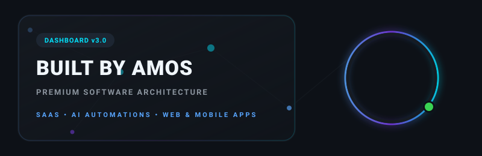

<!--
━━━━━━━━━━━━━━━━━━━━━━━━━━━━━━━━━━━━━━━━━━━━━━━━━━━━━━━━━━━━━━━━━━━━━━━━━━━━━━━━
          PREMIUM DEVELOPER DASHBOARD PORTFOLIO README - ENTERPRISE EDITION V4
━━━━━━━━━━━━━━━━━━━━━━━━━━━━━━━━━━━━━━━━━━━━━━━━━━━━━━━━━━━━━━━━━━━━━━━━━━━━━━━━
-->

<!-- TOP VISUAL HEADER MESH -->
<p align="center">

</p>

<!-- HERO CARD BANNER -->
<p align="center">

</p>

<!-- CYCLING ROLES TYPING INDICATOR -->
<p align="center">

</p>

<br />

<!-- ==================== ⭐ EXECUTIVE DASHBOARD ==================== -->
## 📊 Executive Dashboard

<table width="100%" border="0" cellpadding="8" cellspacing="0">
<tr>
<td width="25%" valign="top">
<strong>🟢 Current Status</strong><br />
<span style="font-size: 12px; color: #8b949e;">Active / Online</span>
</td>
<td width="25%" valign="top">
<strong>⏳ Coding Experience</strong><br />
<span style="font-size: 12px; color: #8b949e;">5+ Years Professional</span>
</td>
<td width="25%" valign="top">
<strong>📂 Repositories</strong><br />
<span style="font-size: 12px; color: #8b949e;">25+ Built Systems</span>
</td>
<td width="25%" valign="top">
<strong>⭐ System Rating</strong><br />
<span style="font-size: 12px; color: #8b949e;">A+ Open Source Score</span>
</td>
</tr>
<tr>
<td width="25%" valign="top">
<strong>🚀 Availability</strong><br />
<span style="font-size: 12px; color: #8b949e;">Open to Contracts / Freelance</span>
</td>
<td width="25%" valign="top">
<strong>🤝 Scope Focus</strong><br />
<span style="font-size: 12px; color: #8b949e;">Enterprise Web &amp; Mobile</span>
</td>
<td width="25%" valign="top">
<strong>🌍 Main Location</strong><br />
<span style="font-size: 12px; color: #8b949e;">Ranchi, Jharkhand, India</span>
</td>
<td width="25%" valign="top">
<strong>🏢 Branding Entity</strong><br />
<span style="font-size: 12px; color: #8b949e;">Built By Amos</span>
</td>
</tr>
</table>

<br />

<!-- ==================== ⭐ INTERACTIVE TERMINAL ==================== -->
## 🖥️ System Terminal Console

```bash
AmosAnand@BuiltByAmos-1801:~$ whoami
Amos Anand (Digital Solution Architect & Software Engineer)

AmosAnand@BuiltByAmos-1801:~$ company
Built By Amos (Technical Digital Agency)

AmosAnand@BuiltByAmos-1801:~$ mission
Build secure, zero-bloat, clean-architecture software that generates real business impact.

AmosAnand@BuiltByAmos-1801:~$ current
Developing high-concurrency CRM portals and clean MVVM Jetpack Compose Android applications.
```

<br />

<!-- ==================== ⭐ ABOUT ME ==================== -->
## ⚡ About Me

<p align="center">
  
</p>

I do not just write code; I design digital infrastructure that solves real-world bottlenecks. My journey as a **Software Engineer** is defined by a relentless pursuit of engineering excellence, performance optimization, and premium UI/UX aesthetics.

My development philosophy centers on **Clean Architecture (MVVM)**, security protocols, clean code, and zero-bloat scalability. Whether it is building a high-concurrency business automation CRM, tuning a database query, or developing a custom Android utility, I ensure the solution is robust, maintainable, and premium.

---

## 🏢 About Built By Amos

<p align="center">
  
</p>

**Built By Amos** is a digital solution architect firm dedicated to transforming business problems into scalable, production-grade applications.

*   **Our Mission:** To democratize premium web applications and custom automation for businesses, eliminating operational inefficiencies.
*   **Our Vision:** To lead open-source, mobile application development, and high-performance custom ERP systems.
*   **Company Values:** High performance, secure database boundaries, visual design integrity, and client operational success.

---

<!-- ==================== ⭐ PREMIUM SERVICES GRID ==================== -->
## 💼 Premium Services Grid

We architect and deploy custom corporate software infrastructure:

<table width="100%" border="0" cellpadding="8" cellspacing="0">
<tr>
<td width="33%" valign="top">
<strong>💻 Web &amp; Portal Systems</strong><br />
<span style="font-size: 12px; color: #8b949e;">
• Premium SaaS web platforms<br />
• Responsive landing pages<br />
• Next.js &amp; Tailwind corporate portals<br />
• E-commerce architectures
</span>
</td>
<td width="33%" valign="top">
<strong>📱 Native Android Engineering</strong><br />
<span style="font-size: 12px; color: #8b949e;">
• Jetpack Compose &amp; Material 3 UI<br />
• MVVM clean architecture apps<br />
• Background worker optimizations<br />
• SDK &amp; system API integrations
</span>
</td>
<td width="34%" valign="top">
<strong>⚙️ Business Automation</strong><br />
<span style="font-size: 12px; color: #8b949e;">
• Custom ERP / CRM consoles<br />
• Auto-billing &amp; inventory trackers<br />
• Telegram &amp; Termux tools<br />
• AI &amp; LLM API orchestrations
</span>
</td>
</tr>
<tr>
<td width="33%" valign="top">
<strong>🎨 UI/UX &amp; Branding</strong><br />
<span style="font-size: 12px; color: #8b949e;">
• High-fidelity Figma design systems<br />
• SVG vector assets &amp; animations<br />
• Custom SVG banners / graphics<br />
• Brand identity consultations
</span>
</td>
<td width="33%" valign="top">
<strong>☁️ Cloud &amp; Integrations</strong><br />
<span style="font-size: 12px; color: #8b949e;">
• Firebase backend integrations<br />
• REST API development &amp; security<br />
• PostgreSQL &amp; MySQL boundaries<br />
• Payment gateways &amp; SMS hooks
</span>
</td>
<td width="34%" valign="top">
<strong>🛡️ Technical Consulting</strong><br />
<span style="font-size: 12px; color: #8b949e;">
• High-performance code refactoring<br />
• Database schema optimization<br />
• Application maintenance contracts<br />
• Speed &amp; SEO audits
</span>
</td>
</tr>
</table>

<br />

<!-- ==================== ⭐ TECH ARSENAL ==================== -->
## 🛠️ Tech Stack &amp; Arsenal

<table width="100%" border="0" cellpadding="8" cellspacing="0">
<tr>
<td width="25%" valign="top">
<strong>💻 Frontend</strong><br /><br />


<br />


<br />


</td>
<td width="25%" valign="top">
<strong>⚙️ Backend &amp; DB</strong><br /><br />


<br />


<br />

</td>
<td width="25%" valign="top">
<strong>📱 Android</strong><br /><br />


<br />

</td>
<td width="25%" valign="top">
<strong>🛠️ Tools &amp; OS</strong><br /><br />


<br />


</td>
</tr>
</table>

<br />

<!-- ==================== ⭐ PROJECT SHOWCASE ==================== -->
## 📂 Product &amp; Repositories Registry

### 💻 Web Development
<table width="100%" border="0" cellpadding="8" cellspacing="5">
<tr>
<td width="50%" valign="top">
<div style="background-color: #161b22; border: 1.5px solid #30363d; padding: 15px; border-radius: 12px; height: 160px;">
<h4 style="margin-top: 0; color: #58a6ff;">🏢 Built By Amos Website</h4>
<p style="font-size: 12px; color: #8b949e;">The main corporate agency portfolio website optimized for conversion and speed.</p>
<div style="margin: 8px 0;">


</div>
<a href="https://github.com/BuiltByAmos-1801/BuiltByAmosMain" style="font-size: 12px; font-weight: bold; color: #00e5ff; text-decoration: none;">📁 View Repository</a>
</div>
</td>
<td width="50%" valign="top">
<div style="background-color: #161b22; border: 1.5px solid #30363d; padding: 15px; border-radius: 12px; height: 160px;">
<h4 style="margin-top: 0; color: #58a6ff;">💼 Amos Portfolio</h4>
<p style="font-size: 12px; color: #8b949e;">Personal software developer portfolio showing tech works.</p>
<div style="margin: 8px 0;">


</div>
<a href="https://github.com/BuiltByAmos-1801/AmosPortfolio" style="font-size: 12px; font-weight: bold; color: #00e5ff; text-decoration: none;">📁 View Repository</a>
</div>
</td>
</tr>
<tr>
<td width="50%" valign="top">
<div style="background-color: #161b22; border: 1.5px solid #30363d; padding: 15px; border-radius: 12px; height: 160px;">
<h4 style="margin-top: 0; color: #58a6ff;">🚘 Shivam Automobile</h4>
<p style="font-size: 12px; color: #8b949e;">Local retail business service catalogue platform with inventory viewer.</p>
<div style="margin: 8px 0;">


</div>
<a href="https://github.com/BuiltByAmos-1801/ShivamAutomobile" style="font-size: 12px; font-weight: bold; color: #00e5ff; text-decoration: none;">📁 View Repository</a>
</div>
</td>
<td width="50%" valign="top">
<div style="background-color: #161b22; border: 1.5px solid #30363d; padding: 15px; border-radius: 12px; height: 160px;">
<h4 style="margin-top: 0; color: #58a6ff;">🎓 Coaching Centre Demo</h4>
<p style="font-size: 12px; color: #8b949e;">Responsive multi-page corporate coaching academy profile showcase.</p>
<div style="margin: 8px 0;">


</div>
<a href="https://github.com/BuiltByAmos-1801/CoachingDemoByAmos" style="font-size: 12px; font-weight: bold; color: #00e5ff; text-decoration: none;">📁 View Repository</a>
</div>
</td>
</tr>
<tr>
<td width="50%" valign="top">
<div style="background-color: #161b22; border: 1.5px solid #30363d; padding: 15px; border-radius: 12px; height: 160px;">
<h4 style="margin-top: 0; color: #58a6ff;">🎨 Oracle Tattoo</h4>
<p style="font-size: 12px; color: #8b949e;">Mobile catalog, booking scheduler, and visual tattoo catalog application.</p>
<div style="margin: 8px 0;">


</div>
<a href="https://github.com/BuiltByAmos-1801/OracleTattoo" style="font-size: 12px; font-weight: bold; color: #00e5ff; text-decoration: none;">📁 View Repository</a>
</div>
</td>
<td width="50%" valign="top">
</td>
</tr>
</table>

<br />

### 📱 Android Applications
<table width="100%" border="0" cellpadding="8" cellspacing="5">
<tr>
<td width="50%" valign="top">
<div style="background-color: #161b22; border: 1.5px solid #30363d; padding: 15px; border-radius: 12px; height: 160px;">
<h4 style="margin-top: 0; color: #58a6ff;">🎬 Movies Downloader</h4>
<p style="font-size: 12px; color: #8b949e;">Custom Android app for scraping, searching, and managing video asset downloads.</p>
<div style="margin: 8px 0;">


</div>
<a href="https://github.com/BuiltByAmos-1801/MoviesDownloader" style="font-size: 12px; font-weight: bold; color: #00e5ff; text-decoration: none;">📁 View Repository</a>
</div>
</td>
<td width="50%" valign="top">
</td>
</tr>
</table>

<br />

### ⚙️ Automation, AI &amp; Business Software
<table width="100%" border="0" cellpadding="8" cellspacing="5">
<tr>
<td width="50%" valign="top">
<div style="background-color: #161b22; border: 1.5px solid #30363d; padding: 15px; border-radius: 12px; height: 160px;">
<h4 style="margin-top: 0; color: #58a6ff;">💼 BuiltByAmos CRM</h4>
<p style="font-size: 12px; color: #8b949e;">Secure agency dashboard managing corporate billing, invoices, and clients database.</p>
<div style="margin: 8px 0;">


</div>
<a href="https://github.com/BuiltByAmos-1801/BuiltByAmos_CRM" style="font-size: 12px; font-weight: bold; color: #00e5ff; text-decoration: none;">📁 View Repository</a>
</div>
</td>
<td width="50%" valign="top">
<div style="background-color: #161b22; border: 1.5px solid #30363d; padding: 15px; border-radius: 12px; height: 160px;">
<h4 style="margin-top: 0; color: #58a6ff;">⚙️ AI &amp; Telegram Automation</h4>
<p style="font-size: 12px; color: #8b949e;">Custom micro-service scripts for Telegram API bots, Termux diagnostic configurations, and business automation hooks.</p>
<div style="margin: 8px 0;">


</div>
<a href="https://github.com/BuiltByAmos-1801/Telegram-Automation-Tools" style="font-size: 12px; font-weight: bold; color: #00e5ff; text-decoration: none;">📁 View Repository</a>
</div>
</td>
</tr>
</table>

<br />

### 📂 Templates, Open Source &amp; Setup Helpers
*   ⭐ **[BuiltByAmos-1801 Portfolio Core](https://github.com/BuiltByAmos-1801/Portfolio)** - The central hub repository for agency works.
*   🛠️ **[Termux Setup Error Fixer](https://github.com/BuiltByAmos-1801/TermuxSetupErrorFixer)** - Automated setup diagnostic scripts resolving package management errors.
*   🏅 **[GitHub Badges Registry](https://github.com/BuiltByAmos-1801/GITHUB_BADGES)** - Dynamic assets repository compiling markdown-ready profile shields.

---

<!-- ==================== ⭐ DESIGN SHOWCASE GRID ==================== -->
## 🖼️ Mobile App &amp; Web Mockup Showcases

### 📱 Android App Features
*   **Finance Manager:** Dynamic ledger app with localized offline SQLite storage, custom charts, and export to CSV.
*   **Job Card Tracker:** Client-facing project progress and servicing report logger for industrial hardware depots.
*   **Attendance App:** QR-based geofenced attendance system using Firebase Realtime Database.

### 💻 Website Showcase Demos
*   **Coaching Centre Demo Website:** [CoachingDemoByAmos](https://github.com/BuiltByAmos-1801/CoachingDemoByAmos) — Responsive multi-page academy profile.
*   **Cafe &amp; Gym Demo templates:** [Cafe Demo](#) &amp; [Gym Demo](#) — Minimal, lightweight, fluid responsive local business interfaces.

---

<!-- ==================== ⭐ EXPERIENCE TIMELINE ==================== -->
## 💼 Professional Experience Timeline

*   🏢 **2025 - Present | Founder &amp; Principal Software Architect**
    *   *Built By Amos (Software Agency)*
    *   Orchestrating agency product cycles, coding responsive React dashboard layouts, configuring SQL databases, and setting up cloud micro-services.
*   💻 **2023 - 2024 | Freelance Software Engineer**
    *   *Remote Contracts*
    *   Architected camera scanning utilities, Android network auditing apps, and business inventory automation scripts.

---

<!-- ==================== ⭐ ENGINEERING PHILOSOPHY ==================== -->
## 🧠 Engineering &amp; Coding Philosophy

*   **Architecture First:** I write modular, clean code separated by layers (MVVM). UI components should never execute business rules.
*   **Zero Bloat Performance:** Web apps should load in under 1 second. Less JavaScript, optimized databases, and clean network requests.
*   **Security by Design:** All client interfaces employ strict validation boundaries, SQL injection barriers, and HTTPS standards.
*   **Aesthetic Balance:** Coding is a science, but presentation is an art. Beautiful UI/UX increases client product retention.

---

<!-- ==================== ⭐ DEVELOPMENT PIPELINE WORKFLOW ==================== -->
## 🔄 Production Pipeline &amp; Workflow

```mermaid
graph LR
  A["1. Discovery / Idea"] --> B["2. Figma UI Design"]
  B --> C["3. Clean Code Dev"]
  C --> D["4. Unit Testing"]
  D --> E["5. Cloud Deployment"]
  E --> F["6. Maintenance & SLA"]
  style A fill:#161b22,stroke:#30363d,stroke-width:2px,color:#f0f6fc
  style B fill:#161b22,stroke:#30363d,stroke-width:2px,color:#f0f6fc
  style C fill:#161b22,stroke:#58a6ff,stroke-width:2px,color:#f0f6fc
  style D fill:#161b22,stroke:#30363d,stroke-width:2px,color:#f0f6fc
  style E fill:#161b22,stroke:#39d353,stroke-width:2px,color:#f0f6fc
  style F fill:#161b22,stroke:#30363d,stroke-width:2px,color:#f0f6fc
```



---

<!-- ==================== ⭐ CURRENT OBJECTIVES ==================== -->
## 🎯 Objectives Monitor
*   **Building:** Corporate CRM management portals and secure micro-services.
*   **Learning:** Neural-Network vector embedding pipelines and offline LLM tooling.
*   **Target:** Optimizing Kotlin backend databases for faster background queries.

---

<!-- ==================== ⭐ GITHUB DASHBOARD ==================== -->
## 📊 GitHub Diagnostics Console

<p align="center">
  
  
</p>

<p align="center">
  
</p>

---

## 🏆 System Trophies &amp; Contribution Snake

<p align="center">
  
</p>

<!-- CONTRIBUTION SNAKE ANIMATION (Pushed by snake.yml Action) -->
<p align="center">
  
</p>

<br />

<!-- ==================== ⭐ DYNAMIC WIDGETS & CONNECTS ==================== -->
## 🌐 System Connections &amp; Metrics

<p align="center">
  <a href="https://portfolio-nine-wine-pvfkm3d3dg.vercel.app/" target="_blank">
    
  </a>
  <a href="https://linkedin.com/company/builtbyamos" target="_blank">
    
  </a>
  <a href="https://wa.me/918757603560" target="_blank">
    
  </a>
  <a href="mailto:builtbiamos@gmail.com" target="_blank">
    
  </a>
</p>

<p align="center">
  
</p>

<!-- DYNAMIC DEV QUOTE -->
<p align="center">
  
</p>

<br />

<!-- FOOTER WITH OVERLAPPING ANIMATED LIQUID WAVES -->
<p align="center">
  
</p>
